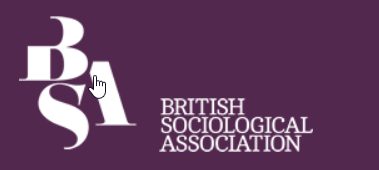
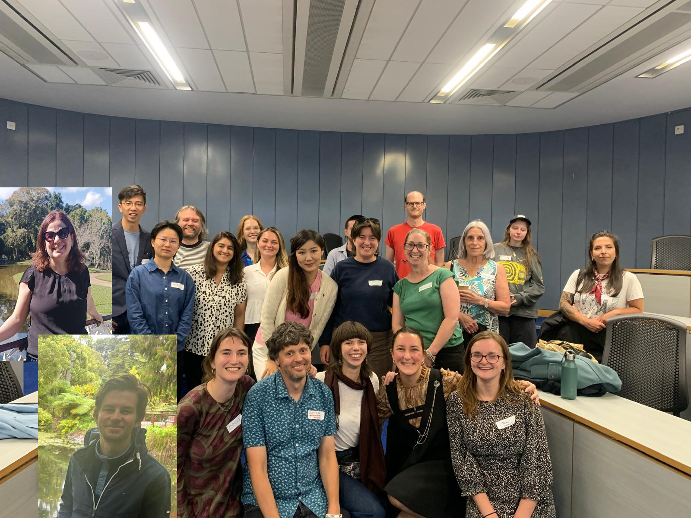

<!--
Add ben and others
 */*-->
---
date: 2025-02-24T08:49:00.000+00:00
layout: post
title: Reflecting on the Reimagining Sociological Imaginaries North East Conference 2025 (funded by the British Sociology Association)
sub_heading: ''
tags: blog
banner_image: ''
related_posts: []
---

Back in December 2024 I saw an email from the British Sociology Association, <a href="https://www.britsoc.co.uk/opportunities/pgf-regional-event-funding/">offering £1000 for any PGRs who wanted to organise a regional conference. I thought, "OK why not?" It seemed like a good idea to meet other academics in and around Newcastle and thought it would help with my CV to say I'd organised a conference. 

So it happened on the 17th July 2025, and it was fab! I'm still kinda buzzing about it. And importantly… no technical disasters happened during the conference! Of course, the biggest pain was trying to deal with Northumbria University finance who couldn't tell us who was able to submit an invoice to the BSA. 

The people who made it happen - Jen, Petra, Beatriz, Sorcha, and last but not least, Ben, you are all stars. And lots of love to Divyali who helped get all this started. I feel like when I finally finish this PhD that I have maybe I have a crew, some cool buddies I can have a drink with when I submit or after my viva!

When I submitted the initial idea for the conference I wrote something about the Sociological Imagination having read it in an article somewhere, and it aligned with writing about social transformation and power. I read the original book, and it was interesting, but very vague in defining what the sociological imagination was. However, that was fine in this context, a vague definition would be more open and would make it easier for people to bring it into their presentations. 

On the day, I was really happy that, not only did every presentation talk about issues of power, most also brought in the idea of the social imagination too. The presentations ranged from late diagnoses of ADHD, SpaceX's destruction of indigenous sacred lands, and rural tourism in China and people's relationship with horses. And every presentation was genuinely super interesting. People made connections and hopefully these will be useful networks that PGRs will use to for research, their careers, and to make friends too.

We also had a film screening of 100 People, which was fascinating. It tells the story of Sheidfield, an area in Newcastle with a very strong community, told through the conversations of 100 different local people who interviewed each other. These ranged from people who still remembered details of the area from 70 years ago, to young children telling bad jokes and talking about the need for love in the community. But the film also raised many interesting questions. In these 100 interviews, how did they find the themes to pull out? The director ____ was on a panel with some members of the community at the end, and I believe someone asked in the Q&A and that it was a community process. At the pub afterwards, I asked the director about what they were doing with all the interviews, because it was only a ___ hour film and if there were 100 interviews then there was perhaps 50 - 100 hours of film. Apparently it is a community coding process, where members of the community will get together once a week to decide how to code and organise the data. Which sounds like some people's idea of a methodological nightmare but sounds fascinating to me!

We hope that next year some of the attendees will be inspired to apply for funding from the BSA to put another PGR conference on! <a href="https://www.britsoc.co.uk/opportunities/pgf-regional-event-funding/">Link for PGR event funding.</a>

Click to see <a href="https://drive.google.com/drive/folders/1ZcXCbRLqw6OmmqOTaLqg8eu14_urSo6j?usp=share_link">more photos</a>

<h1>Full List of Abstracts</h1>
<h2>Policy/Politics </h2>
<h3>Pat Rubio Bertran - Aston University </h3>
<strong>“You won’t have me”: (Central) Mediterranean solidarities, futures, and resistances.</strong>
Throughout history, solidarity and mutual aid groups and networks have been organising to  support migrant struggles from the consequences of organised abandonment (Gilmore, 2008) and necropolitical policies (Mbembe, 2017). In this context, this project contributes to the interdisciplinary conversations on contemporary solidarities with people on the move in the (Central) Mediterranean region by exploring three main pillars: Mediterranean solidarities, Mediterranean futures, and Mediterranean resistances to criminalisation and repression. Through interviews and multi-sited ethnography in Morocco, Spain, Italy, Tunisia, and at sea, this project examines how solidarity is practiced and understood in the region, and how these world-building practices allow us to imagine alternative modes of living.

<h3>Laura Jane Machin - Manchester Metropolitan University</h3>
<strong>In terms of responses to crimes of sexual violence, procedural justice is failing women: An exploration of social and systemic harms to inform a model of transformative reform. </strong>
Despite a steady rise in reports of male-perpetrated sexual violence within the criminal  justice  system of England and Wales over the last decade, the associated conviction rate remains at less than 1% (Office for National Statistics, 2023). 61% of cases are discontinued at the behest of the victim-survivor (Victims Commissioner, 2024). This disparity and lack of confidence in the pursuit of justice suggests that current provisions are unfit for purpose.
This further indicates a need for transformative reform in the response to a criminal behaviour that disproportionately effects women. The question being, however, what should this look like? This study has utilised a Zemiological-Feminist theoretical framework to examine these systemic failings. 25 narrative or semi-structured interviews (dependent on type of participant) have been conducted with Victim-Survivors and Sexual Violence Support Service Practitioners who have engaged with the prosecution process to a greater or lesser extent. The samples were intersectional, and the findings reflected such. The aim being to identify criminal justice principles and responses that are outmoded and unsuitable, inflicting further harm upon those whom which they are designed to protect, and creating barriers to the pursuit of justice. Pertinent themes have been drawn from the collected and analysed data to inform a ‘Better Response/Harm Reduction for Victim-Survivors’ model which reflects the need for intersectional thinking. This will ultimately be disseminated amongst interested stakeholders (3rd sector, local government and community lead initiatives with whom I have spent considerable time building relationships), in the hope that it will inform gender-based violence discourse and policy discussions.

<h3>Khyati Jain - University of Nottingham</h3>
<strong>Marketisation of non-traditional international schools in India: from the perspective of local parents as customers. </strong>
The government of India introduced the New Education Policy (NEP) 2020 with the aim to restructure the national education system by 2030. The policy initiatives addressed some entrenched issues of educational inequality by prioritizing Quality Education as part of United Nation (UN) Sustainable Development Goal (SDG4).
However, the policy failed to problematize the marketisation of the privately owned non- traditional international schools (NTIS) that offer an international curriculum but primarily consist of local staff and students. These schools diminish policy efforts by enabling local families to exit from their national school system, while their high tuition perpetuate inequality by limiting access to local elites and the middle-class sections of the stratified Indian society.
My reflexive experience as an Indian parent whose child was in NTIS inspired me to explore the role of parents as customers in the growth of these schools. The qualitative data collected from 64 parents across 28 NTIS queried their experience of school choice, admission, and engagement at these schools. In line with UN SDG4, the analysis provided valuable insights into organizational learning for national curriculum schools and possible future amendments to NEP 2020.

<h3>Beatriz Moraes Vidal – University College London </h3>
<strong>Beyond binomials: towards a feminist paradiplomacy. </strong>
My research introduces a feminist perspective to the study of paradiplomacy. Paradiplomacy is understood as diplomacy exerted by non-state actors: intranational polities’ international engagement in order to promote political, economic, and/or cultural developments. This always implies the existence of two or more actors (state and sub-state), and the lack of jurisdiction or competence of the sub-state actors in the international state-centric realm. This creates critical limitations on who is “allowed” to participate in the diplomatic theatre, sparking debates about recognition, sovereignty and legitimacy, which can (and should) be viewed through a feminist lens. Drawing upon C. Wright Mills’ sociological imagination, this paper argues that such tensions are not abstract political debates, but are deeply felt public issues that manifest as the personal troubles of individuals living within these liminal spaces.
After a review of the literature on feminist geography, international relations, sociology and feminist, anti- and alter-geopolitics, a definition of “feminist paradiplomacy” is presented. By introducing intersectionality and relational thinking, this proposed feminist approach to paradiplomacy points towards a more inclusive concept of “gender” and leaves behind the gender/sex binomial of female/male. This allows researchers to embrace the plurality and multiplicity of actors and agencies, and to focus on new, emerging and embodied paradiplomacies. As an example of these paradiplomacies, this paper brings a case study that examines how geopolitical events shape performances of paradiplomacy conducted by the frontier city of La Línea de la Concepción (Spain). To conclude, this research advocates for this new feminist interpretation of paradiplomatic relations as a tool to promote new geographies of peace, opening up new realms of cooperation.

<h2>Health and wellbeing</h2>
<h3>Victoria Nunn -  Northumbria University</h3>
<strong>Advancing NHS–VCSE Evaluation Practice Using a Sociological Imagination. </strong>
This presentation explores how applying a sociological imagination to health system evaluation can reframe relationships between the NHS and voluntary, community, and social enterprise (VCSE) organisations. It draws on my dual role as an academic researcher and the VONNE Development Coordinator for Assura* - a nationally supported pilot to co-design a shared NHS–VCSE outcomes and impact framework in the North East and North Cumbria Integrated Care System (ICS). Assura responds to long-standing issues in NHS commissioning, where VCSE organisations are asked to demonstrate impact but given  limited influence over how outcomes are defined, measured, or valued. Rooted in real-world  system change, this work challenges technocratic assumptions of neutrality in data and evidence. Instead, it proposes that commissioning and evaluation are deeply sociological: they embed assumptions about what knowledge counts, whose voices matter, and how value is made visible.
Using insights from early engagement across ICB leaders, local VCSEs, and peer learning with West Yorkshire ICS, I argue that co-designing an outcome framework is not just a  technical task but a political one. The process exposes contradictions in language, competing logics of care, and deep tensions between transactional procurement and relational community work. I am approaching the Assura project through a critical sociological lens, informed by my PhD research on power, governance, and knowledge production in mental health research partnerships. This positionality enables me to identify and name structural patterns others may overlook, such as the invisibilisation of community labour, or how short-term funding undermines sustainable care.
Ultimately, the talk reflects on how embedding sociological reflexivity within system transformation work can disrupt tokenistic co-production and move toward more equitable, reflective, and impactful partnerships. It speaks to wider questions of legitimacy, structure,  and change, calling for a reframing of evidence practices that centre people, relationships, and community-led knowledge.
*Assura plc is a UK-based property company specialising in general practitioner and primary healthcare buildings, with over 600 sites across the country. Listed on the London Stock Exchange and part of the FTSE 250 Index, it is funding the Assura project as part of its corporate social responsibility (CSR) commitments.

<h3>Ecaterina Rotaru – Northumbria University</h3>
<strong>Overlooked and Undiagnosed: How ignoring overlapping identities, delays ADHD diagnosis in women – and what this means for society. </strong>
Attention-Deficit/Hyperactivity Disorder (ADHD) is a chronic neurodevelopmental condition with symptoms that persist into adulthood, affecting cognitive, emotional, and functional wellbeing (Serralla, et al.,2022). Despite similar prevalence across genders, women are significantly underdiagnosed. In the UK, approximately 2 million adults are estimated to have ADHD, yet men are diagnosed up to four times more often than women (ADHD UK, n.d.). Globally, the diagnostic ratio varies from 2:1 to as high as 10:1, reflecting historical gender bias embedded within diagnostic frameworks (Mowlem, et al., 2019).
Using C. Wright Mills’ concept of the sociological imagination, this disparity must be understood not as individual failure but as a public issue shaped by systemic norms. Diagnostic criteria were developed around externalised, male-typical symptoms, often missing the more internalised and masked presentations common among women — such as inattention, anxiety, and emotional dysregulation (Martin, 2024). As a result, many women remain undiagnosed until adulthood, in many cases after being treated for misdiagnosed conditions.
This diagnostic delay has profound implications. Women with ADHD are disproportionately affected by unstable employment, higher rates of sick leave, and reduced labour market participation (Helgesson, et al., 2023). The psychosocial consequences—low self-esteem, identity confusion, and chronic stress—further hinder career progression and wellbeing (Burgess, 2000). Qualitative research highlights daily struggles with organisation, time management, emotional regulation, and social functioning, all of which contribute to workplace instability and career dissatisfaction (Aoki, et al., 2020; Crook & McDowall, 2024; Holthe & Langvik, 2017).
Intersectionality sharpens this analysis by revealing how overlapping identities — gender, neurodivergence, social class, and race—compound invisibility and delay recognition and support. Addressing these issues requires systemic change: adapting diagnostic tools, embedding neuroinclusive practices in education and employment, and reframing career development theory to account for non-linear, identity-intersected paths. As Mills argued, personal troubles often reflect structural failings (Staubmann, 2021). Until these are  addressed, women with ADHD will remain overlooked—by both medicine and society.

<h3>Chung-Yen Cheng - Durham University</h3>
<strong>Exploring Shame as a Barrier to Accessing Holistic Medicine and the Grassroots Efforts to Overcome It – The Case of Northeast England. </strong>
This paper shows how shame is a barrier to accessing holistic medicine, and the grassroots efforts that have been dedicated to overcoming it in Northeast England. Research has shown that shame negatively impacts the efficacy of health interventions, while also exacerbating health inequalities (Dolezal &amp; Lyons, 2017; Dolezal, 2022; Northrop, 2017; Stangl et al., 2019). Such research has elevated shame from a personal experience to a structural problem, reigniting the sociological imagination and making shame in medicine a social justice issue. However, current literature mostly focuses on the modern healthcare system, which is dominated by modern Western medicine. I argue that since holistic medicine, such as yoga, Tai Chi, acupuncture, and massage, remains an essential part of the landscape of care, it is important to explore the role of shame in accessing holistic medicine. My research findings are drawn from fieldwork in Northeast England, where I did 50 interviews with users and practitioners of holistic medicine, and conducted participant observation in holistic medicine classes and therapy sessions. I found that shame prevents people from accessing holistic medicine in two ways. First, people think they could not achieve the goals set by practitioners. Second, people think they are unwanted by practitioners because of their class, disabilities, gender, or incompatible schedules. I also observed grassroots efforts to overcome the shame of accessing holistic medicine, which can be allocated to two categories. First is to break down tasks into smaller pieces. Second is to expand one-to-one services to one-to-many or many-to-many services so that people can find practitioners and peers they gel with to support them. My research findings would raise awareness of the role of shame in holistic medicine and inform policymakers of ways to support more inclusive wellbeing initiatives in Northeast England.

<h3>Laura Tidd - Durham University</h3>
<strong>How do we recover from the unrecoverable? A brief exploration of recovery narratives inborderline discourse. </strong>
As per a recent article by Woods et al., recovery is the ‘dominant’ framework attached to the treatment of mental-ill health across governmental and third-sector institutions and organisations in the United Kingdom (2022). Following the adoption of recovery-as-
orientation, public mental health services across the four constituent nations underwent significant reform and redesign to wholly encompass ‘recovery’ – including the use of recovery narratives, such as the Scottish Recovery Network’s 2004 narrative research project (Smith-Merry et al., 2011).
The Borderline Personality Diagnosis, meanwhile, remains a challenging fit into the recovery approach, as individuals with the diagnosis are still considered by many within the NHS to be ‘unresponsive to treatment’ (Katsakou et al., 2012). A 2016 meta-review found that clinician perspectives of BPD‘recovery’ had real-world implications for individuals with the diagnosis seeking treatment (Ng et al., 2016). As such, the recovery narratives which appear in the borderline literature can look somewhat different from the narratives which often appear in mainstream discussions of mental ill-health and distress.
Individuals diagnosed with BPD may, in light of their different experiences of treatment, feel more comfortable describing their personal narrative using terms outside of the ‘recovery’ paradigm. One study in particular found respondents preferred use of terms aligned with ‘journey’, ‘acceptance’, and ‘learning’; a rejection of an end-goal recovery narrative (Larivière et al., 2015, p.560). These findings align with earlier work by Natasha Mauthner, whose research with mentally distressed women found they were best able to refuse the external narrative of defect by accepting their own narrative, and ‘acceptance of their difficulties’ (Mauthner, 2010, p.474). How do recovery narratives look different for individuals diagnosed with BPD then, when unlike in clinical and common academic discourse, symptom reduction is not chosen as a priority?

<h2>Society and environment </h2>
<h3>Zhoyia Inam - Birmingham City University </h3>
<strong>Water challenges in the UK: responsibility and accountability in government-private sector relations. </strong>
As climate change and resource mismanagement intensify, the global water crisis now affects the Global South and countries in the Global North. In the UK, all four nations face growing water scarcity risks, exposing critical tensions between water as a human right and an economic good. These tensions are particularly pronounced in England and Wales, where privatised water management raises questions about where accountability and responsibility should lie—government bodies or private water companies.
This research addresses a critical gap in the political ecology literature by examining how accountability and responsibility in water governance are distributed across different ownership models in the UK. At the current data collection and analysis stage, preliminary findings suggest that under private ownership, responsibility and accountability remain in flux between government bodies and private water companies, often prompting political intervention. Using a mixed-methods approach, the study compares England and Wales (private ownership) with Scotland and Northern Ireland (public ownership). It employs Natural Language Processing (NLP) to analyse parliamentary debate transcripts and corporate reports, alongside semi-  structured interviews with corporate and government officials, to offer a multi-faceted perspective on water governance.
This study critically examines the implications of differing governance paradigms on water sustainability by interrogating the UK’s response to water scarcity. It seeks to contribute to ongoing debates around the balance of public and private responsibility in water management. It offers insights into how countries can navigate growing water challenges in an era of climate uncertainty.

<h3>Titas Dutta - Michigan State University</h3>
<strong>Human-Free Spaces, Human Costs: Sustainability for Whom? An Intersectional Approach to Relocation and Local Livelihoods in the Buxa Tiger Reserve, India. </strong>
In recent decades, the rapid loss of biodiversity has become a global concern. A significant portion of the world’s biodiversity, concentrated in the global south, is increasingly threatened by anthropogenic pressures of land use change, degradation, and overexploitation. These are further exacerbated by weak governance, political instability, unrestricted economic growth, and the global markets. As countries in the global south grapple with the legacies of colonialism, power imbalances in resource ownership, and the extraction of natural and land resources, my research focus on creation of Protected Areas (PAs) and displacement.
PAs has been fundamental to conservation, beginning with Yosemite National Park in 1864 in the United States. The IUCN define PAs as “clearly defined geographical spaces, recognized, dedicated, and managed through legal or other effective means, to achieve the long-term conservation of nature along with associated ecosystem services and cultural values.” Many of these biologically diverse ecosystems are inhabited by traditional and indigenous communities.
I introduce the key concerns with reduced access to forests due to conservation in India, particularly as faced by tribal groups and women living within the Buxa Tiger Reserve in India. I employ environmental justice, intersectionality, and political ecology frameworks to address rights violations within BTR. Conservation has resulted in extensive relocation, adversely impacting local tribal populations. However, these actions have been justified on the grounds of biodiversity conservation and are largely omitted from the displacement literature. While scholarship address land dispossession in India, there exists a gap concerning the gendered impacts of such displacement, particularly in the context of PAs. Specifically, there is a lack of comparative analyses regarding the impacts and overall sustainability of such conservation projects. An overview of the scholarly literature indicate that conservation initiatives have further marginalized already disadvantaged populations in the name of ‘development.’

<h3>Ben Hetherington, University of Warwick</h3>
<strong>Nature-based solutions to vulnerability: a political ecology approach. </strong>
Vulnerability as a concept has entered the global discourse of climate change and biodiversity, and one of the regions often flagged as vulnerable to climate change effects is the Mediterranean. The site of this research, the Camargue delta, faces an existential threat as a result of rising sea levels, leading to concerns over the safety of property, livelihoods and cultural heritage, and prompting several proposals for how to respond that tend to come into conflict. The research in this paper explores a further addition to the climate and biodiversity discourse, nature-based solutions (NbS). This research explores NbS’ social impacts in the context of climate change adaptation efforts in the Camargue and draws on observation undertaken at a local conservation research centre and semi-structured interviews conducted with actors from relevant socio-professional groups. The fieldwork focused on the implementation of a state-funded coastal wetland restoration project on the site of former industrial saltworks, and looked into the influence of certain factors - for example geographical features, social relationships, political agency and economic structures - on the social impacts felt alongside hydrological and biodiversity benefits. What makes this case particularly controversial are the conflicting interests brought into relief by the threat of sea-level rise and erosion of protective seawalls along parts of the coastline. The saltworks is a site where attempts are being made to 'renaturalise' a landscape in which the majority of people are unfamiliar with anything but a heavily anthropocentric treatment of space. To have one’s way of life threatened by ‘nature’, otherwise considered as the subject of humanity, is a notion uneasily received by local actors, and in turn exacerbates their discontent with conservation organisations who may be encouraging projects that champion solutions based upon ‘nature’. This paper aims to contribute to research of NbS that are focused on climate vulnerability in post-industrial, rural contexts.

<h3>Bárbara Garcia Ribeiro Soares da Silva - University of Campinas</h3>
<strong>Should new forms of sociability explain contemporary society? </strong>
The article examines the question “How society and communication are defined, explained and critiqued by the sociology of media and communication”. The theme of lasting friendship in contemporary society was developed on my PHD thesis and it´ll be the main resource of this paper. Firstly, it will be explained the reason why the term “contemporary society” was chosen to represent a society influenced by the omnipresence of the new technologies, the Internet and the hyper-connected smartphones mostly. Also it´ll be described the definition of a new form of sociability detected in this society, forged after a bibliographic review on sociability. Finally, to define and explain the concept of “network phone sociability”, I´ll present the qualitative research. Various authors have provided a spectrum of interpretations of this society: “networked society” (Manuel Castells) and “information society”; (Antonio Marín). Instead of conceptualizing it, Pierre Lévy pointed the formation of a new communicational space: the “cyberspace”;. Before Lévy, David Harvey had discharged the existence of a paradigm shift in the society and understood the social and cultural contemporary transformations from that period as “post-modern condition”. In order to discuss the existing sociability in the aforementioned society, I assumed Raquel Recuero’s “virtual community” concept. Recuero had distinguished virtual communities from social networks by demonstrating that online social networks can estabilish new social forms of groups and communities, whilst studying fotologs in Brazil. Equally significant to my research is the Santaella e Lemos’s “sociability in the network”.
Last but not least, I studied the fundamental parts played by the smartphones on the new styles of interpersonal communication and sociability - which Richard Ling had called “the telephone sociability”. Finally, I`ll present the “network phone sociability” concept, inspired not only by the bibliographic review, but also by the 37 semi-structured interviews with young adults from São Paulo.

<h2>(Post-)neoliberal horizons</h2>
<h3>Alex Lee - (University of Brighton)</h3>
<strong>The Postpolitics of Rewilding. </strong>
Rewilding is frequently suggested as a ‘radical’ solution to the biodiversity crisis. This radicalism is generally positioned in relation to traditional conservation practices, which are described as reactive, expensive and premised on control over nonhuman natures. Rewilding instead suggests that a different approach can be more ethical, cost-effective and suited to a world facing increasing environmental crises. However, rewilding has much less to say about the similarly urgent social crises, and as such, could be inadvertently exacerbating these problems. Based on qualitative analysis of 24 interviews with people connected to rewilding, such as landowners, consultants, activists and NGO workers, this paper discusses how rewilding often supports a political status quo that is at odds with a just and sustainable future. A thematic analysis of this data shows that while owners position themselves, or are positioned by others, as doing “the right thing”, many interviewees frame private rewilding primarily in terms of a neoliberal governmentality. This discourse promotes the idea of profit-making, commodification of nature, and large incentives for a small number of wealthy landowners, which would likely further increase wealth inequality in the UK. It also could reinforce the power of a small clique of elites, who are often constructed as crucial to saving biodiversity, while further alienating many other people from the countryside. Given the interconnections between neoliberalism, injustice and environmental breakdown, this paper argues that rewilding as a ‘radical’ solution, as articulated by these interviewees, is not nearly radical enough.

<h3>Rebecca Donaldson - Newcastle University</h3>
<strong>Food Movements as Spaces for Prefigurative Political Praxis and Proximal Care. </strong>
Food poverty persists in the UK despite its wealth, with charitable food aid—particularly food banks—becoming the dominant response over the past 15 years. Critical food systems research highlights three fundamental problems with food banking as the primary approach to food insecurity. First, it depoliticizes food poverty, treating hunger as an isolated issue rather than addressing its systemic roots. Second, it reflects the neoliberalisation of welfare, shifting responsibility from state welfare provision to charitable organizations and reframing food as a discretionary gift rather than a fundamental human right. Third, it perpetuates  stigma and precarity, subjecting individuals to shame and insecurity as they rely on overstretched, patchwork aid networks. 
Drawing on data from a 12-month ethnography, this paper explores how food movements position themselves as offering meaningful alternatives to the corporate food regime, rejecting hierarchical charity models in favour of network-based mutual aid and intentional care structures. Their work forms a prefigurative political praxis, wherein their organisational methods reflect the equitable structures they strive to create on broader institutional and political levels. Central to these movements is care and solidarity, fostering relationships through shared meals, collective decision-making, and proximity—whether bureaucratic, spatial, or emotional. These environments thus offer opportunities for re-imagining both caring relations and food systems.
Despite their efforts, food movements still struggle to fully escape neoliberalism. Questions persist about how to build sustainable and just ways of materially supporting communities without inadvertently replicating charity-based frameworks. This paper therefore explores the tensions within food movements, their strategies for disrupting hegemonic food systems, and their role as transformative spaces for imagining food justice.

<h3>Daniel Walsh - Northumbria University</h3>
<strong>The More-than-Planetary Ecologies of the Space Industrial Complex: Tracing the Production Assemblages of Spaceflight from the American South to Beyond Earth. </strong>
From Ancient Greek, geography means ‘earth-writing’. The nascent sub-field of geography, ‘outer space geographies’, has highlighted that critical geographical scholarship has largely been earth-centric, predicated on a binary that separates earth from the cosmos. Any critical research therein has been restricted to the planetary. On the other hand, the ‘space economy’ has been forecasted by McKinsey (2025) to expand to $1.8 trillion by 2035. Leading this charge are ‘NewSpace’ companies that, often with lucrative contracts from the US government and military, provide products and services including rocket launch vehicles with launch operations; orbital human spacecraft; lunar landers and rovers; and propulsion technology. This ‘space industrial complex’, comprised of interwoven capitalist and military actors, is expanding (settler-)colonial/capitalist logics beyond earth, resulting in the commodification and militarisation of the cosmos, as well as entrenching these logics back on earth. To challenge the hegemony of the space industrial complex, and to effectively address our current political-economic conjuncture, critical geographical scholarship must adopt a ‘more-than-planetary’ approach. Employing feminist approaches to global production networks (e.g. Marion Werner and Anna Lowenhaupt Tsing), assemblage theory, and relational conceptualisations of space (e.g. Henri Lefebvre, Doreen Massey), this research will trace the ‘production assemblages’ of spaceflight in the American South (including New Mexico), which alongside California and Florida, is becoming the hub of the American space industrial complex. It will investigate the production processes of spaceflight, defined  expansively to include political-economic and socio-cultural considerations, from extraction to end use covering terrestrial and cosmic domains via ethnographic fieldwork and  conjunctural analysis. This presentation will provide a conceptual exploration underpinning this research, which will have implications for broader critical geographical scholarship to become ‘more-than-earth writing’.

<h2>Physical and social (im)mobilities </h2>
<h3>Heidi Rui Yang - Carnegie School of Sport, Leeds Beckett University</h3>
<strong>Rhetoric and Realities of (Im)Mobility in Horse Riding Tourism: Ethnographic Insights from Rural Southwest China. </strong>
This research explores social transformation and (im)mobility through human-horse relationships in a clan-based, impoverished village within a National Park in Southwest China. Based on 5.5 months of ethnographic fieldwork, the study focuses on villagers who lead horses for tourists as part of the local tourism economy. Formerly peasants, construction, or factory workers, many returned over the past decade, purchased a horse, and began working in tourism. Their experiences reveal shifting generational attitudes toward mobility, labour, and aspirations. Younger participants expressed a sense of being trapped. They hoped to migrate to urban areas to explore the world, but limited education and weak social networks made decent employment largely inaccessible. Yet they were reluctant to stay in the village, often expressing embarrassment about being unmarried. Middle-aged returnees emphasised the relative freedom and flexibility this work offers compared to their former labour- and time- intensive jobs. Staying in the village allowed them to care for young children, aging parents, livestock, and farmland. However, they faced economic insecurity due to the seasonal and unstable nature of tourism, often taking temporary jobs in nearby areas to supplement their income. Older participants showed appreciation for their current roles, describing the tourist site as “a nursing home”. Compared to a lifetime of harsh agrarian labour, they enjoyed the physical activity, social interaction, and modest income. Yet they also faced age-related exclusion, as some tourists distrusted their ability to ensure safety and requested younger people to lead the horse instead. This study highlights how physical and social (im)mobilities are negotiated differently across generations. Life stages and the rise of tourism in the context of China’s ongoing modernisation both constrain and open possibilities for those disadvantaged rural people to practice their agency.

<h3>Michelle Huang</h3>
<strong>Breaking Barriers or Entrenching Divides? Re-examining Social Mobility in China’s Neoliberal Landscape Through Governmentality Theory. </strong>
Since the initiation of economic reform in 1978, China has undergone remarkable economic  development, especially since the 21st century. Meanwhile, market forces have led to an overall vertical decline in domestic social mobility, including both occupational and educational mobility. Horizontal mobility from agricultural to non-agricultural sectors has increased dramatically in the past few decades. During this time, while social mobility for Chinese men was still exceedingly high, it was highly restricted for Chinese women and those with a rural hukou (household registration) to mobilize upwards. Such spatial and class hierarchies manifested in social mobility trends indicates aggravated regional disparity and social stratifications albeit with economic development. Whilst the government has been pushing for ‘Common prosperity’ through redistributing wealth and ameliorating inequalities, the current neoliberal landscape reflects a gap between the rhetoric and social reality. It is therefore important to unpack how different social groups, especially marginalized groups (e.g., rural women) navigate or resist these structures, potentially challenging or reinforcing power relations. This paper will mainly draw on the Foucauldian theory of governmentality, including biopolitics and apparatus of self-surveillance to unpack power relations regarding this specific topic. Using a neoliberal framework through the lens of Foucault’s governmentality theory and prior studies on social mobility in China, this paper will unravel how the structural inequalities are shaped and conditioned, contributing to a deeper understanding of how social inequalities persist despite rapid economic growth.

<h3>Sorcha Macintyre - Northumbria University </h3>
<strong>Running Late and Then Left Behind- a Mobilities Framework for Delay. </strong>
Transport delays are experienced in cities globally and are detrimental to ways in which people perceive mobility. The result of delay can be harmful to economic, social and environmental change on both individual and collective levels. With the North East Combined Authority (NECA) seeking to build an integrated transport network, this paper develops a mobilities framework for ‘delay’, arguing that it is an intersection point between the material and lived experience of transport infrastructure can revealing the realities of integration. 
The field of mobilities has established that whilst “everything is on the move”, significant immobility also emerges as a consequence (Adey, 2006).  Expanding upon the notion of immobility this paper explores how the affective and embodied qualities of delay are rendered through transport infrastructural negotiations.  This paper specifically examines the impact of delay on the perspectives of transport in the North East of England and how it becomes embodied through the individual mobile lived experience.  
This paper focuses on three transport infrastructures: the Tyne and Wear Metro, the Sheilds Ferry and the A1 Western Bypass Motorway. Through go-along interviews, written stories and participatory “ride along” focus groups, the data demonstrates that ‘delay’ is a core component to affective attachments, promise and perceptions of future regional development. The data supports that an alternate knowledge which contributes to understandings ‘socially integrated’ transport network. 
This paper advances the concept of ‘delay’, and how it is fundamental to the perspective of transport, shaping lived experiences and negotiations across contexts.  It proposes it as a way forward to advance the scholarship on socially integrated transport networks. Whilst being grounded in the Northeast of England, this paper also contributes to broader discussions on urban transition of post-industrial cities, shedding light on the future mobility for people and places that are seen as ‘left behind’.  

<h3>Georgie Holmes - Aston University</h3>
<strong>Sea migration and boat spaces: materialities and infrastructures of mobility across maritime borders. </strong>
This paper summarises the aims of my PhD project, and outlines how my research will be conducted, as I explore the spatialities and materialities of sea migration across the Channel, the body of water that rests between the UK and France. The number of people who cross the Channel in small boats continues to rise each year, with 2022 seeing an exceptional 45,774 crossings. By the term ‘spatiality’, I use Doreen Massey’s definition of space as that which is socially constituted and always under construction, and spatiality to mean the politics within such a space. The two main spaces I am concerned with are the sea and the various maritime vessels involved in migratory journeys across and within the Channel. The representation of small boats has been the centre of debates concerning immigration to the UK, especially relating to their portrayal in news reports; the term ‘small boats’ has been co-opted to depict images of ‘swarm[s]’ of ‘illegal’ or ‘criminal’ invaders. The Channel is thus a site to analyse how different types of spatialities are formed in maritime vessels. In my project, I will conduct vessel analyses of boats that reflect carceral, rescue, and non-white spaces. These spaces are fluid and not confined to a single space, and vessels can be sites reflecting multiple spaces at once.

<h2>Participatory mapping methods for social change</h2>
<h3>Shannon Sahni - Birbeck University of London</h3>
<strong>Exploring Imprisoned Women’s Experiences of Drug Dependency through Space Mapping Methods. </strong>
This presentation shares my experience of using creative space mapping methods as a PhD student studying imprisoned women’s experiences of victimisation and empowerment in drug dependency. Space mapping methods are promoted as a powerful and flexible means to speak on, listen to and learn from lived experiences of social disadvantage, oppression, and marginalization. It is firstly demonstrated how participating women used space mapping methods and spatial concepts to share, represent and make sense of the otherwise difficult to communicate, complicated, conflicting, and messy realities of drug dependency. With this, space mapping methods, and the lens of space more broadly, are considered as useful tools that may be used to generate thick and rich insights into the multiple, infinite and coexisting diversities that shape lived experiences. A number of fieldwork experiences are then reflected on to outline the limits and merits of space mapping methods. Based on these research reflections, space mapping methods are presented as an alternative, creative, engaging and sensitive means to research in the space of prison, and to learn from the lived experiences of the ‘researched’.

<h3>Petra Codato - University of Hull</h3>
<strong>Transformative shorelines: creative and participatory mapping to promote collective sociological imagination in sites affected by climate-induced coastal changes. </strong>
Climate-induced coastal changes are becoming increasingly rapid and threatening on the UK’s coastline, with severe impacts on coastal communities and the landscapes in which they live. This project aims to harness the potential of creative and participatory methods to encourage the development of collective sociological imagination in a location on the East Coast of Yorkshire, an area already particularly affected by coastal erosion and, in the long term, sea-level rise. Specifically, I am using participatory mapping combined with other creative methods to explore how critical engagement with past and present histories of living on the coast can enrich participants’ understanding of the future challenges and opportunities presented by a changing shoreline. By discussing issues of power and space over time through creative methods and engaging in a common journey that learns from the past to imagine the future of the coastal location, participants in the research project are invited to co-create new connections with places and people, thus fostering their collective sociological imagination. Evaluating the effectiveness of these methods will help identify community empowerment pathways for place-based transformational adaptation. After introducing the theoretical and methodological framework of the research, this paper will discuss the role of creativity in opening safe spaces for conversations about the transformation of a place by presenting preliminary results of creative participatory mapping activities undertaken during my fieldwork.

<h3>Ashley van Huis - Northumbria University</h3>
<strong>Co-Visioning Our Neighbourhood: Embedding visually-driven, co-creative approacheswithin  Neighbourhood Planning. </strong>
Neighbourhood planning, introduced in England and Wales through the Localism Act 2011, aims to democratise planning by giving communities greater control over local development through a framework for community-led engagement. Despite this intention, Neighbourhood Planning often fails to convert community knowledge into actionable policies, perpetuating top-down decision-making and limiting equitable outcomes. This research examines how integrating visually driven, co-creative methods into statutory neighbourhood planning can redefine professional roles, enable collaborative placemaking, and bridge the gap between informal community insights and formal, evidence-based planning that prioritises technical expertise. By identifying challenges and opportunities for embedding community-led, co- creative approaches within statutory processes, the research contributes to the discourse on participatory planning. It focuses on the situated nature of participation in Neighbourhood Planning, investigating how co-creative strategies could enhance inclusivity while addressing practical barriers and epistemological tensions in integrating local knowledge into techno- rational planning systems. The paper outlines considerations and conceptual directions for future efforts toward reconciling community insights within formal frameworks.

<h2>Posters </h2>
<h3>Helen Simmons - Northumbria University</h3>
<strong>Befriending relationships in the care sector.</strong>
This research applies Mills’ sociological imagination (1959) to understand how the individual experiences of people in befriending relationships connect to broader opportunities for systemic innovation in the care sector. By positioning young people as co-designers in participatory workshops involving befriending volunteers, we explored how services could be enriched. Journey mapping and other creative methods revealed that common challenges often surface opportunities. The young people co-created practical prototypes including befriending toolkits and advice handbooks while strengthening their befriending and peer relationships. The project exemplifies Mills’ vision of connecting individual experiences to broader possibilities for positive social change.

<h3>Caitlin MacKinlay - Durham University</h3>
<strong>Punitive Performativity - Exploring Queer Experiences of UK carceral spaces.</strong>
This research aims to explore the lived reality of incarceration for queer people within UK prisons. I will examine how ‘normalising’ powers of carcerality with cis-heteronormativity attempts to discipline queer carceral bodies. Rather than cataloguing the suffering of incarcerated people, I will explore how queer people experience, navigate, (re)negotiate and resist carceral spaces; demonstrating how queer knowledges and embodied experiences rearticulate and resist the anticipated gender and sexuality codes of carceral spacetimes, in order to survive and make life liveable whilst incarcerated.

<h3>Dominika Zwęglińska-Gałecka</h3>
<strong>Institute of Rural and Agricultural Development of the Polish Academy of Sciences</strong>
How Do Farmers Become Middle Class?
Transformational and post-transformational social changes in rural Poland—namely depeasantization, proletarianization, and rural gentrification—have significantly altered the internal structure of the farming population and the principles underpinning its social differentiation. Today, this group represents a dynamically shrinking segment, characterized by pronounced internal stratification. Of particular analytical interest is the emergence and consolidation of a subgroup of large-scale private farm owners. This group is distinguished by substantial landholdings, high levels of agricultural output, and relatively elevated income
levels. These characteristics align with the profile of middle-class entrepreneur-professionals. This subgroup constitutes the focal point of the present analysis, which seeks to determine whether, and to what extent, large-scale farm owners acquire traits conventionally associated with the middle class. The conceptual premise suggesting the potential classification of certain farmers as middle class is predominantly grounded in observations of their economic capital (e.g., income levels or land area). It is accompanied by the assumption that owners of large-scale farms earn incomes comparable to professionals and entrepreneurs, which may indicate their gradual upward shift in the social structure. In the literature, this process—entailing the progressive incorporation of farmers into the middle class—is referred to as embourgeoisement (Manchin, Szelényi, 1985; Laferté, 2014, 2018). The term denotes the transition of farmers into a social class traditionally composed of individuals engaged in cognitive or intellectual professions requiring prolonged education and advanced competencies, valued in the labor market and typically associated with commensurate income levels. As a result of this transition, farmers increasingly acquire new status-related and class-based attributes, as well as novel forms of economic, cultural, and social capital. This development dilutes the “purity” of their social position as a distinct segment within the stratification system, leading to a peculiar combination of contradictory class positions. The broader interpretive framework for analyzing the embourgeoisement of farmers and the trajectories underpinning this process is provided by models of social mobility. The objective of this presentation is to characterize the process of embourgeoisement among Polish farmers. We will outline the criteria enabling the classification of farmers as members of the middle class and, drawing on qualitative research findings, identify key economic, social, and cultural features that testify to the hybrid character of this group. This hybridity stems from their simultaneous embeddedness in traditional agrarian structures and their adaptation to entrepreneurial and modernizing patterns typical of the middle class.

<h2>Film - 100 People</h2>
As part of the day, we will be screening a film called ‘100 People’, which is a beautiful ‘portrait of co-existence’ of life within the geographical location of our conference - Shieldfield, in the east end of Newcastle. The filmmaker, Andrew Wilson, will join us alongside a number of community members who appear in the film for a discussion after the screening.
In a world that loves a story of individual heroes and successes - as writer, historian and activist Rebecca Solnit has observed - ‘we are not very good at telling stories about a hundred people doing things’. 100 People responds, ‘What if we tried?’ The film combines conversations between residents and workers, diverse in age, ethnicity, and economic background, to present a collective spirit of everyday solidarity and resistance emerging in a small residential community.
We hope that both the film and the ensuing discussion will help fuel and refresh our sociological imaginations in a way that’s grounded in the reality of life in the community we’re gathering in.
You can find out more about 100 People here: <a href="https://www.iamandrewwilson.co.uk/100-people">https://www.iamandrewwilson.co.uk/100-people</a>.

